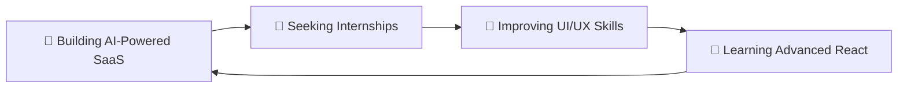

# Hi 👋, I'm Tanujeet Singh

  

  
  
  

## 🚀 About Me

🔭 **MERN Stack Developer** passionate about building modern web apps with smooth UI/UX  
🌱 Currently learning: **Advanced React.js, AI Integration & UI Design**  
👨‍💻 All of my projects are available at [GitHub](https://github.com/Tanujeet)  
💬 Ask me about **React, Next.js, Node.js, MongoDB, AI APIs**  
📫 How to reach me: **singhtanujeet@gmail.com**  
⚡ Fun fact: I love turning ideas into sleek, responsive, and interactive web applications!

---

## 🛠️ Tech Stack & Tools

### Frontend

### Backend & Database

### Tools & Platforms

---

## 📊 Featured Projects

### 🧠 HireSense - AI Resume Analyzer

**Tech Stack:** Next.js, OpenAI API, Tailwind CSS, Prisma, PostgreSQL  
AI-powered resume analysis with ATS scoring and improvement suggestions

### 🎯 PitchCraft - AI Pitch Deck Generator  

**Tech Stack:** Next.js, OpenAI API, Prisma, PostgreSQL, Clerk Auth  
Generate professional pitch decks with AI-powered content creation

### 📁 StoreIt - File Management System

**Tech Stack:** Next.js, Appwrite, Tailwind CSS, TypeScript  
Secure file upload, preview, and organization with modern UI

### 🎤 Converso - AI Voice Assistant

**Tech Stack:** Next.js, Supabase, Voice API, Tailwind CSS  
AI-powered voice assistant for educational guidance and support

---

## 📈 GitHub Stats

  

  

  

---

## 🎯 Current Focus

```mermaid
graph LR
    A[🚀 Building AI-Powered SaaS] --> B[💼 Seeking Internships]
    B --> C[🎨 Improving UI/UX Skills]
    C --> D[🔧 Learning Advanced React]
    D --> A
```

---

## 🏆 GitHub Trophies

  

---

## 📊 Activity Graph

  

---

## 🌐 Connect With Me

  

---

  

  <h3>✨ Let's build something awesome together! ✨</h3>
  

---

⭐ **From [Tanujeet Singh](https://github.com/Tanujeet)** - *Building the future, one commit at a time* 🚀

